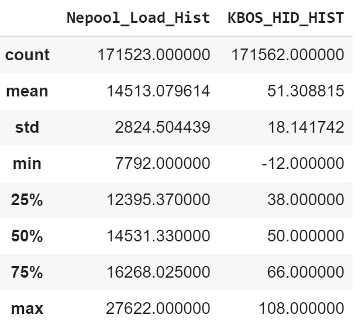
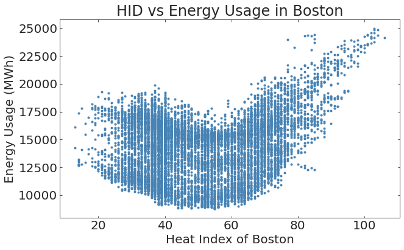

# MLTSAProject

# Abstract
Energy consumption forecasting is vitally important for energy companies and government agencies to properly hedge their assets and control prices.  In this project, we forecast the New England region’s NEPOOL energy consumption with Boston’s historical weather data from 2000 through 2019 using machine learning methods in an attempt to accurately predict New England energy consumption in the next 1-6 months.  In the first step we plan to implement Facebook's Prophet package using a decomposable time series model.  In the next step, we will create an alternative model with recurrent neural networks. The results from both models will be compared statistically.

# Introduction
In the United States, the transmission and wholesale of electricity is regulated by the Federal Energy Regulatory Commission (FERC).  Regions of the country that are deregulated are split into separate entities created by FERC, known as independent system operators (ISOs), which coordinates the electric grid of that region.  In this paper, we will be analyzing and forecasting energy demand in ISO New England (commonly called NEPOOL, the New England Power Pool), which encompasses Connecticut, Maine, Massachusetts, New Hampshire, Rhode Island, and Vermont.

Numerous reasons exist for the need to forecast load.  One such reason is for utility companies to supply energy to their customers--if the companies do not have enough supply to meet demand, they will have to buy the energy to meet that demand from the expensive real-time energy market.  To prevent such shortages, utility companies can buy cheap contracts that ensure a certain amount of energy will be supplied days, weeks, or months in advance.  These contracts act as a hedge for the companies, saving them the extraordinary cost to buy from the real-time market.  Therefore, it is necessary for utility companies to forecast energy consumption.  More accurate forecasting means more accurate hedges can be taken by companies to prevent major expenses and price swings in the energy market.

The forecasting problem becomes progressively more difficult as energy demand is isolated to smaller regions, as events such as outages will have a larger effect on the time series.  For this reason, it is desirable to start by producing proof of concept techniques on energy demand in larger areas.  This is our motivation for forecasting the entire New England region.

Load forecasting is a well-documented problem that many scientists have tackled. Yildiz [2] describes several modern methods in regression and machine learning that have been used to forecast load over the years, including autoregressive models, regularized linear regression, support vector regression, neural networks, and random forests. One of the first in-depth analysis of neural networks in load forecasting is explored by Park et al [2], reporting a mean absolute percent error of 2% on day-ahead forecasts.

# Data
Data

Two datasets are used in this project. The following table highlights the shape and types of data used in the datasets.
|Dataset name|URL|Number of rows|Number of valid rows (not NaN on relevant columns)|Number of columns|Number of relevant columns|Data type for each relevant column|
|---|---|---|---|---|---|---|
|nepool|https://www.iso-ne.com/isoexpress/web/reports/load-and-demand/-/tree/net-ener-peak-load |171,562|171,562|18|2|All floats|
|weather_noaa|https://www.ncdc.noaa.gov/cdo-web/ |299,952|299,952|124|9|All floats|
**Table 1:** High level description of datasets.

The primary dataset used in this project is the Net energy peak and load by source for NEPOOL. In this dataset, load is the amount of energy that is consumed at a single point, expressed in Megawatt-hours. This dataset covers the time interval from January 1st, 2000 to July 29th, 2019. Figure 1 shows a typical energy demand for the year 2015. The other relevant feature in this dataset is the Heat Index, which combines historical temperature and humidity data at Boston Logan International Airport, measured in degrees Fahrenheit. Figure 2 shows the variation in energy consumption for the area for the period of 50 days starting on 21st of February, 2001.

**Figure 1:** A time series sample of Energy demand for year 2015 for the New England area.

**Table 2:** Snapshot of `nepool.describe()`

The second dataset includes the historical weather data for the Boston area. This data was acquired from Climate Data Online (CDO), presented by NOAA. The data was acquired using the following criteria:
 * Weather Observation Type/Dataset: Normals Hourly
 * Date Range: 
   * 2000-01-01 00:00 to 2009-12-31 23:59
   * 2010-01-01 00:00 to 2019-07-29 23:59 
 * Search for: Stations
 * Search Term: WBAN:14739

Due to limits on the size of datasets that can be ordered at a time, two separate datasets were requested and then concatenated together. The resulting dataset contained many different attributes relating to the hourly weather conditions over the time period covered by the NEPOOL dataset. From the subset of categories, the following nine were highlighted as relevant features to be used in this analysis:
 * Altimeter Setting (inches)
 * Dew Point Temperature (°F)
 * Dry Bulb Temperature (°F)
 * Precipitation (inches)
 * Relative Humidity (%)
 * Sea Level Pressure (inches)
 * Wet Bulb Temperature (°F)
 * Wind Speed (mph)

**Figure 2:** Correlation between energy consumption and Heat Index of Boston for the period between 2001-02-21and 2002-04-13

**Table 3:** Snapshot of `weather_noaa.describe()`

# Methodology
The Prophet package by Facebook will be the main tool utilized to complete this project. This model will optimize the parameters using a direct optimization approach.

An initial exploration of the NEPOOL dataset suggests the presence of three significant seasonalities:
1. **Yearly:** Because of various seasons over the period of a year, we observe a periodic rise and fall in the consumption of energy. The demand is higher in summer and winter, and lower in spring and autumn.
2. **Weekly:** The typical work week is five days, and the weekend two days. There is a considerable difference in power usage during the off days compared to the work days, with energy consumption tending to be greater during business days than on the weekend.
3. **Daily:** Initial analysis shows an increased demand in the morning and during the day. The energy load drops off at night time.

These seasonalities will be considered in the model by implementing the specified seasonalities in the Prophet model.

Energy demands follow different patterns in the summer as in the winter. In the summer months, the energy load rises throughout the day, peaks in the evening, and then sharply drops at night. However, during the winter months the data exhibit a double peak. The energy load rises sharply in the morning, retracts during the afternoon, and then reaches a second, higher, peak in the evening before dropping at night. The spring and autumn months follow daily motions somewhere in between these two distributions. The Prophet model will also be trained to recognize these seasonalities.

Another factor that must be considered is holidays. On a holiday, the energy demand more closely follows that of a weekend. The Prophet package has the built-in capability to recognize holidays in its model. This will be used to acknowledge the effect of holidays.

We use the NOAA dataset to analyse the effect of variation in weather on the energy demand. Rather than use all available weather variables, a principal component analysis (PCA) will be conducted to decrease the number of features in the dataset. A subset of the PCA elements will be chosen so that the majority of the variability in the full NOAA dataset is accounted for while limiting the number of features used. These components will then be added as regressors to the Prophet model.

To measure the performance of the Prophet model, a binary classification problem will be overlayed on top of the underlying forecasting problem. For all points in the historical energy usage data, a binary rule will be added stating whether or not the model prediction fell within 5% of the actual energy usage. This set of binary classifiers will then be used to plot an ROC curve and more in-depthly analyze the performance of the Prophet model.

In addition to the Prophet model, we will be implementing neural networks.  Using our principal components as described above, we will first implement a basic feedforward network, followed by a recurrent neural network, and compare their results to the Prophet model.
