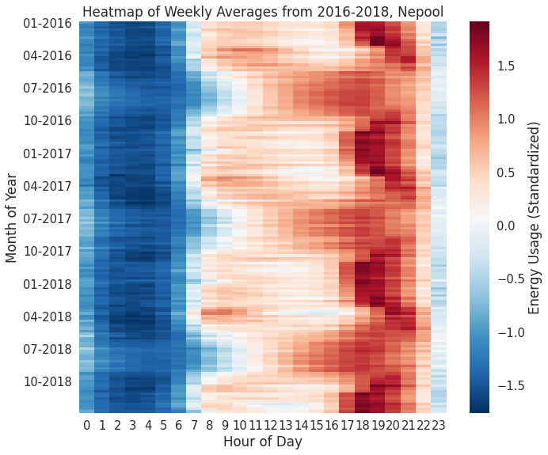
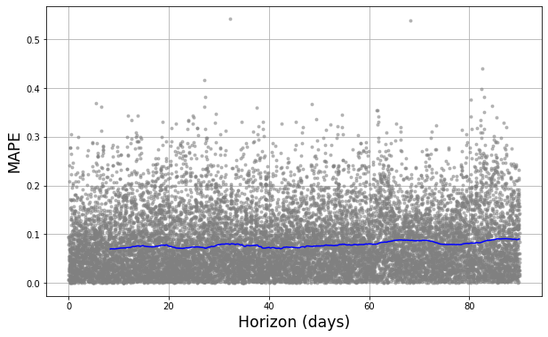

# Forecasting New England Energy Consumption

# Purpose
This is the final project for the course Machine Learning for Time Series Analysis (MLSTA 667) at the University of Delaware. The course instructor is Dr. Federica Bianco. The team members associated with this project are Jonathan Clifford, Desiderio Pilla, and Ramiz Qudsi. All are graduate students at UD.

## Roles
 * Jonathan Clifford, @takao8, jcliff@udel.edu, Data/Literature Manager
 * Desiderio Pilla, @DesiPilla, dmpilla@udel.edu, Methodology Manager
 * Ramiz Qudsi, @ahmadryan, ahmadr@udel.edu, Communication/Visualization Manager

# Abstract
Energy consumption forecasting is vitally important for both energy companies and government agencies to properly hedge their assets and to ensure sustainability and access to the resource. Using historical weather data for the city of Boston (2000 to 2019), we performed a statistical analysis of energy forecasting for the New England region. Two different models using Facebook’s Prophet package and feedforward neural networks were developed to forecast load upto 90 days in advance. Results from the two methods show differing statistical behaviours with a best performance from Prophet of 7.45% hourly mean average percentage error over a 3 month period.

# Introduction
In the United States, transmission and wholesale of electricity is regulated by the Federal Energy Regulatory Commission (FERC).  Regions of the country that are deregulated are split into separate entities created by FERC, known as independent system operators (ISOs), which coordinate the electric grid of that region. For each of these regions, load (the amount of energy that is consumed at a single point, expressed in Megawatt-hours) forecasting is vitally important for the smooth and sustainable functioning of the area. Since produced electricity must be consumed immediately [1,2] (due to limited implementation of battery technology except for California [17]), an accurate forecasting of load will avoid wastage of energy in cases of over production, risk of blackouts, or in case of under production the necessity to buy energy to meet that demand from real-time energy markets, which tend to be expensive.  In this paper, we present our analyses and results from forecasting energy demand in ISO New England (commonly called NEPOOL, the New England Power Pool), which encompasses Connecticut, Maine, Massachusetts, New Hampshire, Rhode Island, and Vermont.

Load forecasting is a well-documented problem and ample literature is available for various methods.  ARMA [3,4], ARIMA, linear regression [5], expert systems, neural networks [6,7], fuzzy logic [4], support vector machine [8,9], and ant colony optimization [9] are some of the major methods used for electrical load forecasting. [10] describes several of these modern methods in detail and [11] presents an extensive review. One of the first in-depth analyses of neural networks in load forecasting is explored by [11], reporting a mean absolute percent error of 2% on day-ahead forecasts.

For our study, we used two models: Facebook’s Prophet (FP), which is based on an autoregressive method, and a feed forward neural network.  We also explore an attempt to implement recurrent neural networks.

# Data

The primary dataset used in this project is the net energy load by source for NEPOOL. This dataset was acquired from the ISO New England website and covers the time interval from January 1st, 2000 to July 29th, 2019, with a cadence of 1 hour for each observation. Figure 1 shows a typical energy demand for the year 2015. The other relevant feature in this dataset is the Heat Index (HI) [12], which combines historical temperature and humidity data at Boston Logan International Airport, measured in degrees celsius. Figure 2 shows the correlation between load and HI in Boston for the period between 2000 and 2019. The graph shows two populations during the winter months, which merge into one as  the HI increases. As expected, load increases as the HI increases (decreases) from the global minima point as people turn on their cooling (heating) systems.

**Figure 1:** A time series sample of Energy demand for year 2015 for the New England area.

**Table 2:** Snapshot of `nepool.describe()`

 

The second dataset includes historical weather data for the Boston area. This data originates from Climate Data Online (CDO), presented by NOAA. The data was acquired using the following criteria:
 * Weather Observation Type/Dataset: Normals Hourly
 * Date Range: 
   * 2000-01-01 00:00 to 2009-12-31 23:59
   * 2010-01-01 00:00 to 2019-07-29 23:59 
 * Search for: Stations
 * Search Term: WBAN:14739

Due to limits on the size of datasets that can be ordered at a time, two separate datasets were requested and then concatenated together. The resulting dataset contained many different attributes relating to the hourly weather conditions over the time period covered by the NEPOOL dataset.

**Figure 2:** Contour plot between energy consumption and Heat Index of Boston for 2000-2019.  Although showing evidence of two populations in the winter, they merge into one in the summer, dissuading the possibility of disjoint populations.

**Table 2:** Snapshot of `weather_noaa.describe()`

|Dataset name|URL|Number of rows|Number of valid rows (not NaN on relevant columns)|Number of columns|Number of relevant columns|Data type for each relevant column|
|---|---|---|---|---|---|---|
|nepool|https://www.iso-ne.com/isoexpress/web/reports/load-and-demand/-/tree/net-ener-peak-load |171,562|171,562|18|2|All floats|
|weather_noaa|https://www.ncdc.noaa.gov/cdo-web/ |299,952|299,952|124|9|All floats|

**Table 3:** High level description of datasets.

 

# Methodology

## Facebook Prophet

The Prophet package by Facebook is one of the two tools utilized to complete this project. This model optimizes the parameters using a direct optimization approach.

An initial exploration of the NEPOOL dataset suggests the presence of three significant seasonalities:
1. **Yearly:** Because of various seasons over the period of a year, we observe a periodic rise and fall in the consumption of energy. The demand is higher in summer and winter, and lower in spring and autumn.
2. **Weekly:** The typical work week is five days, and the weekend two days. There is a considerable difference in power usage during the off days compared to the work days, with energy consumption tending to be greater during business days than on the weekend.
3. **Daily:** Initial analysis shows an increased demand in the morning and during the day. The energy load drops off at night time.

These seasonalities have been considered in the model by implementing the specified seasonalities in the Prophet implementation.

**Figure 3:** Heatmap showing weekly averages of daily energy load from 2016-2018.  In this figure, the summer and winter seasonalities are clearly shown.  Note the smooth transition of daily seasonalities between summer and winter.

 
Energy demands follow different patterns in the summer as in the winter. In the summer months, energy load rises throughout the day, peaks in the evening, and then sharply drops at night. However, during the winter months the data exhibits a double peak. The energy load rises sharply in the morning, retracts during the afternoon, and then reaches a second, higher peak in the evening before dropping at night. The spring and autumn months follow daily motions somewhere in between these two distributions. The Prophet model has been trained to learn different daily seasonalities for days in different seasons.  (See Appendix A for more details)

Holidays must also be considered. On a holiday, the energy demand more closely follows that of a weekend. The Prophet package has the built-in capability to recognize holidays in its model, and has been implemented in the model as well.

We used the NOAA dataset to analyze the effect of variation in weather on the energy demand. Rather than use all available weather variables, a principal component analysis (PCA) was conducted to decrease the number of features in the dataset (see Results for more details). The most relevant  components were added as regressors to the Prophet implementation.

To measure the performance of the model, we compute the mean absolute percent error (MAPE) of its predictions:

where *At* is true load, *Ft* is forecasted load, and *n* is the size of our test set. The objective is to minimize MAPE on the test set.

## Neural Networks

We implemented two different neural networks; a feed-forward network and a recurrent neural network.

For both the neural networks, we discarded the PCA and fit on the standardized features.  The reason for discarding is from the neural network’s ability to learn patterns from correlated data. The training set available was large enough to optimize the parameters without fear of overfitting from lack of data. Additionally, due to inclusions of dummy variables (described below), its mixture with PCA components produced noticeably worse results that were difficult to resolve. As this model doesn’t require uncorrelated features, we chose to drop the PCA components.

Both the networks are supplied with dummy variables to help them learn the seasonalities of the data.  These dummy variables include hourly, monthly, holiday, and weekend indicator variables.  Overall we retain 45 features to feed into the neural nets.

In constructing the feedforward network, we created 8 dense layers, each decreasing in size. 4 dropout layers are interwoven to prevent overfitting. We used the mean squared error for our loss function as it is a natural loss function (including any Minkowski metric) for regression problems. Additionally, each layer uses a ‘tanh’ activation function, chosen due to its common usage in regression tasks. In our model, we split our training, validation, and testing as the following: after choosing a point in our data set to test forward from, we select the previous year from that point to validate, the previous 2 years from the validation to train, and the upcoming 3 months to test. The points we chose are the first of February, May, August, and November, to test on Spring, Summer, Fall, and Winter, respectively. We cross-validate for an accurate test error by training/validating and testing through multiple years, and obtain an overall MAPE.

Due to computational issues with the cross-validation, only a limited range could be cross-validated at one time. In this paper we obtained cross-validation results from 2011-2012. Due to a memory leak in the Tensorflow code, training of further than 1,000 epochs resulted in a likelihood of a computer crash. For the purposes of tuning this model, these computational limits are debilitating and require to be resolved for proper testing.

A recurrent neural network was also implemented, with properties described in the Results section.

# Results

## Principal Component Analysis

The principal component analysis revealed that only the first two components were needed to explain nearly 98% of the variance in the weather dataset (Figure B.1). This is very beneficial, as it allowed us to reduce the dimensionality of the dataset from 9 features to 2. This saved hours in the model training / cross-validation step of the analysis.

It is also noteworthy which weather features were most represented in the PCA components. The two components were almost entirely composed of the Dew Point Temperature, Wet Bulb Temperature, Dry Bulb Temperature, and Relative Humidity (Figure 4). This is important, as it tells us precipitation is essentially excluded from our model.

**Figure 4:** The bar chart shows the weight attributed to each weather feature for the first two principal components. These components assign most of the weight to the three temperature features and relative humidity.

## Additive Regression with Facebook Prophet

A few different models were created before to tune the parameters of the Prophet implementation. An initial glance at predictions shows that the model was able to capture enough of the seasonality to make hourly forecasts without the confidence interval blowing up (Figure C.1).
The mean absolute percent error (MAPE) of the model was acceptable for this model. Depending on the time period, the model was able to produce very accurate predictions. On the hourly level (the scale at which predictions are made), the model had a MAPE of 7.45%. However, across the 16 cross-validation periods, each of which forecasted 90 days of energy demand, the 3-month MAPE was much lower, at roughly 2.35%.

|Hourly|Daily|Monthly|3 Months|
|--|--|--|--|
|7.45%|6.22%|3.97%|2.35%|

**Table 3:** Results of the Additive regression model based on the granularity of the evaluation window.

The reason for this can be seen by examining the residuals (Figure C.4). The model’s errors are well behaved; they follow a mostly normal distribution that is centered very close to 0. The median error was 23.88 MWh, which is less than 0.2% of the average energy load. With the error being mostly balanced, any under-estimated predictions were mostly offset by over-estimates.

One concern with this model is that it relies on weather data to make predictions. However, when forecasting future energy consumption, the hourly weather data is unknown. This becomes more unclear when considering this model uses principal components as opposed to distinct weather features. In these forecasts, future weather values were assumed to be the average value–over a three hour rolling window for that specific hour, day, and month–of   the principal component over the nearly 20 years of training data. While this adds a level of uncertainty to the model’s predictions, we claim that this will not affect the predictions very much.  Figure C.5 shows that the prediction residuals were nearly identical for this model and a model that excluded weather regressors altogether. In the sans-weather model, the hourly MAPE only rose to 7.78%, and even had a 3-month MAPE of 2.32%, slightly better than our final model.

Another good sign from this model was that its prediction error stayed relatively constant throughout the forecast range (Figure 5). This means that the model can be used with the same confidence for predicting energy consumption 10 days out as it can be predicting 90 days out. One limitation, however, is that the model tends to forecast conservatively when there are large spikes in energy load. Figure C.5 shows that the density of high energy load predictions was smaller than the true frequency of high-load observations.

**Figure 5:** The absolute percent error of each observation in the 16 cross validation periods, plotted as a function of their time into the future. Observations on the left are predictions closer to the time of forecast, while observations plotted on the right are predictions farther away from the time of estimation. The blue line is the rolling average of the absolute percent errors.

 

## Feefforward Neural Network

An analysis of the feedforward neural network’s output shows promise but fundamental errors in its predictive power. Viewing the residual plot in Figure 6 shows the nature of the issue–although producing a favorable MAPE, an instability emerges in the MAPE rolling average. This portrays an inconsistency in the accuracy. Overall, the model returned an hourly MAPE of 9.12% over 3 months.

**Figure 6:** The absolute percent error of each observation over a timespan of 2 years with the feedforward neural network model, similar to Figure 5.  

Although stated with uncertainty, through analysis of the output of the model, the nature of the neural network’s inaccuracy stems from a tendency to overpredict the true values (see Appendix D.2). Analysis of the unnormalized residuals shows a median of +200.03 MWh, further confirming its tendency to overpredict. Previous versions of this model overpredicted due to incorrectly incorporating weekend behavior; this model doesn’t exhibit such behavior, yet overpredicts values on a seemingly arbitrary basis (see Figures D.3, D.4), which is likely explained by poor fitting.

Due to limited cross-validation (described in Methodology), difficulty was had in properly tuning the feedforward net. This likely produced the unstable MAPE shown in Figure 6.  Not only could the model’s hyperparameters not be tuned, training was difficult after 1000 epochs, even though the model could potentially train further (see Figure D.1).  Further tuning and effective cross-validation will need to be performed before appropriate testing and evaluation can be done on the neural network’s forecasting power for energy demand.

 

# Deliverable
The output for this project is a model that will be used to predict NEPOOL energy usage. This model will forecast the next 1 - 6 months of energy usage in the New England region. 

# Bibliography
[1] B. Yildiz, J.I. Bilbao, A.B. Sproul, "A review and analysis of regression and machine learning models on commercial building electricity load forecasting," in IEEE Transactions on Power Systems, vol. 73, pp. 1104-1122, June 2017.

[2] D. C. Park, M. A. El-Sharkawi, R. J. Marks, L. E. Atlas and M. J. Damborg, "Electric load forecasting using an artificial neural network," in IEEE Transactions on Power Systems, vol. 6, no. 2, pp. 442-449, May 1991.
